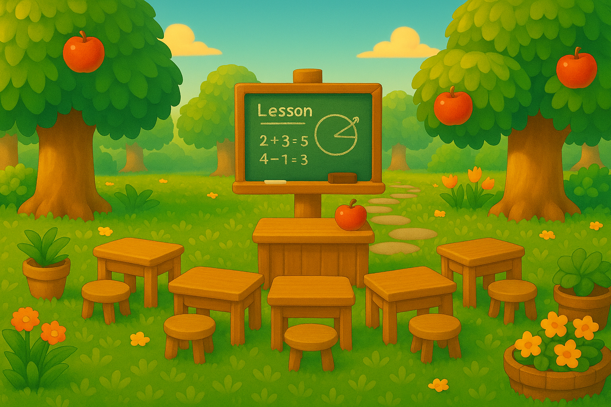

# Next Session Handoff

## Current branch

`master` — all work is committed and pushed directly to master.

---

## What's done

### redesign/ — fully built, linked site

| Page | File | Status |
|------|------|--------|
| Home | `redesign/index.html` | Done |
| Work | `redesign/work.html` | Done — CareerRiver image (no chain SVG), 4 case studies |
| Method | `redesign/method.html` | Done |
| About | `redesign/about.html` | Done — 4 sections with thumbnail insets |
| Praise | `redesign/testimonials.html` | Done — 15 testimonials + education/certs |

Nav on all 5 pages: Home · Work · Method · About · Praise

### Section thumbnail layout (Option A)

Banners were replaced with small thumbnail images (~220px wide, full aspect ratio, no cropping) that sit to the right of each section heading in a flex row. CSS class: `.section-intro` wrapper + `.section-thumb` img.

### Images

All section thumbnails live in `redesign/` alongside the HTML files. **Use relative paths (no `../`)**

| Section | File | Location | Status |
|---------|------|----------|--------|
| The Human Behind the Projects | `AboutHero.png` | `redesign/` | ✓ |
| Three Things I Always Bring | `ThreePillars.png` | `redesign/` | ✓ |
| One More Thing (Teaching) | `TeachingScene.png` | `redesign/` | ✗ MISSING — thumbnail removed from about.html |
| Things I Love | `ThingsILove.png` | `redesign/` | ✓ |
| What People Say | `Testimonials.png` | `redesign/` | ✓ |
| Education & Certifications | `Education.png` | `redesign/` | ✗ MISSING — still points to `../inspiration_samples/Education.png` |

**ProfilePicture.jpeg** (hero avatar on about.html) still lives in `inspiration_samples/` — needs to move to `redesign/`.

### When images are uploaded to redesign/

For **TeachingScene.png**: restore the thumbnail in `about.html` around the "One More Thing" section:

```html
<div class="section-intro">
  <div class="section-h">
    <h2>One More Thing</h2>
    <span class="section-tag">teaching</span>
  </div>
  
</div>
```

For **Education.png**: update `testimonials.html` line ~333:
```
src="../inspiration_samples/Education.png"  →  src="Education.png"
```

For **ProfilePicture.jpeg**: update `about.html` line ~303:
```
src="../inspiration_samples/ProfilePicture.jpeg"  →  src="ProfilePicture.jpeg"
```

---

## Still open

1. Upload `TeachingScene.png` to `redesign/` — then restore thumbnail in about.html
2. Upload `Education.png` to `redesign/` — then update path in testimonials.html
3. Move `ProfilePicture.jpeg` to `redesign/` — then update path in about.html

---

## Technical notes

- All redesign work lives in `redesign/` — root files untouched
- Same CSS design tokens and fonts across all pages (`--coral`, `--teal`, `--mustard`, `--lavender`, `--sage`)
- Fonts: Playfair Display (headings) + Nunito (body)
- Hero kicker color: `--lavender` on About + Praise; `--coral` on Work + Method
- Nav is fully self-contained within `redesign/` (no `../` links)
- `inspiration_samples/` still has the CareerRiver.png used by work.html
- `inspiration_samples/old/` — all files are 2-byte corrupt stubs, not recoverable
